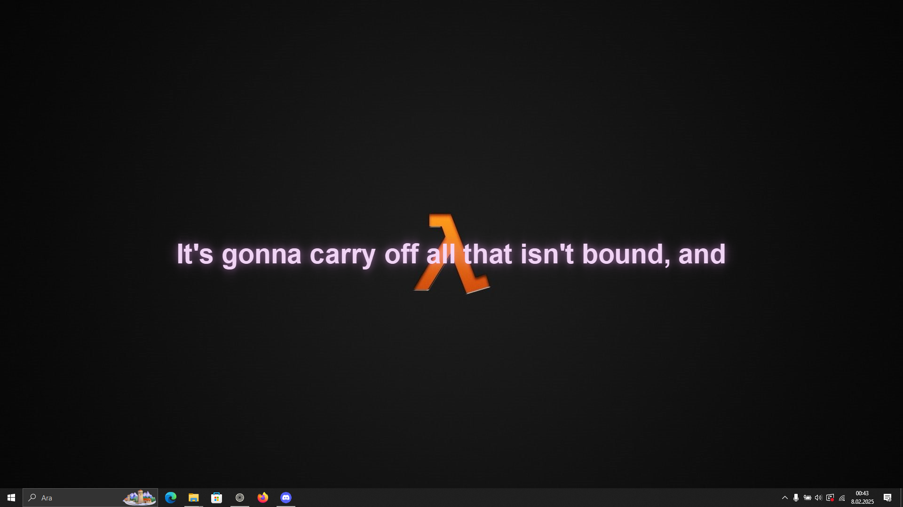

# Lyrify

Lyrify is an application that displays song lyrics as a dynamic wallpaper on your desktop. It supports the LRC file format and synchronizes the lyrics with the music for an engaging experience.

## Features:
- Display song lyrics on your desktop
- Synchronize lyrics with music using LRC files
- Smooth transitions of lyrics across the screen

## ⚠️ Warning: YTMusic Integration

To use the YouTube Music integration for downloading MP3 and LRC files, you need to have **FFmpeg** installed on your system. 

### How to Install FFmpeg:
1. Open **PowerShell**.
2. Run the following command:
   ```bash
   winget install ffmpeg
   ```

## Usage:
1. Download and run the application.
2. Load an LRC file.
3. Enjoy the lyrics displayed on your desktop.

## Disclaimer:
This application is a tool for displaying song lyrics only and does not include any music copyright content. It does not play audio, only synchronizes and displays the lyrics. Please use music content in accordance with copyright laws.

## Installation:
To install Lyrify:
1
1. Download the latest release from the [Releases](https://github.com/Clypus/Lyrify/releases) page.
2. Extract the files to a folder of your choice.
3. Run the `Lyrify.exe` (or the corresponding executable for your platform).

## Contribution:
Feel free to fork the repository, make changes, and submit pull requests. Contributions are always welcome!

## License:
This project is licensed under the MIT License - see the [LICENSE](LICENSE) file for details.

## Screenshots


